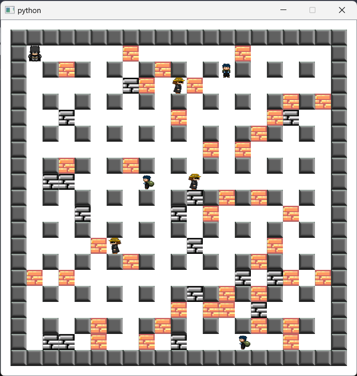

# bomberman-2d-game

## Requirements
Python 3.x  
Libraries: PyQt5, xml.etree.ElementTree, sqlite3, random, json. You need main.py,objects.py and images_rc.py all in the same folder.  
 
## Instruction
In GUI you can choose one of three modes: one player, two players or internet mode (still in progres). Also you can enter the dimensions of the board 10-80. 
There is possibility to save four settings in .json file or history game in sql file or xml.  
To move player use keys on you keboard and to place bomb use SPACE. To move second player use "AWSD" keys and "E" to place bomb. 
Be careful, game is over when hero touch the enemy or is in range of bomb.  
The game is won when you destroy all enemies or find the exit.

## Game

